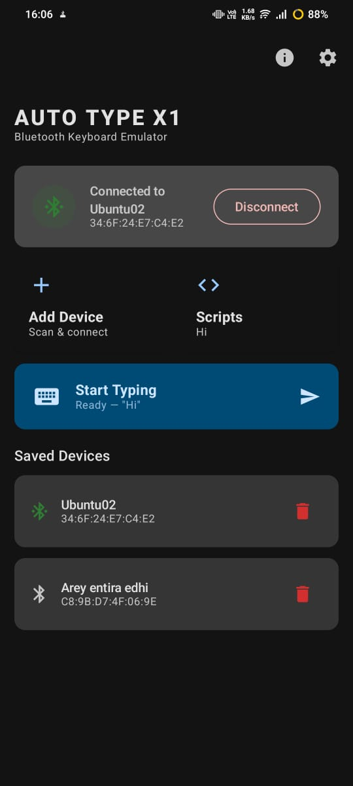
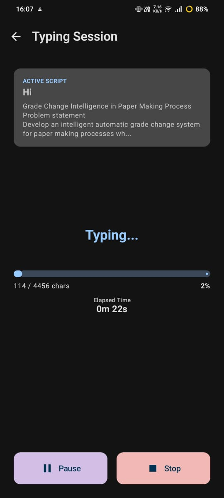
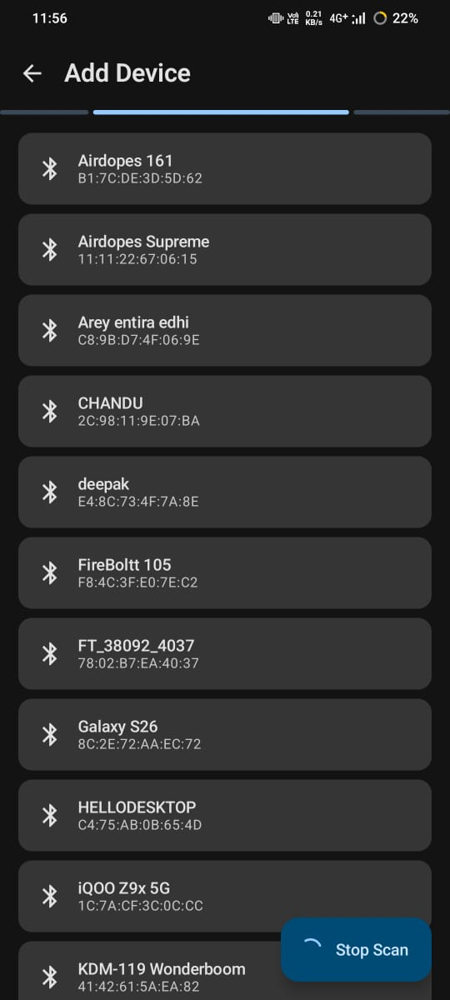
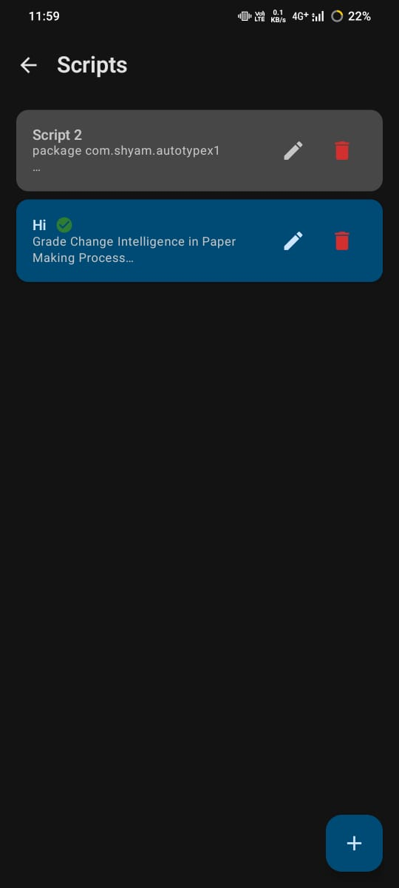
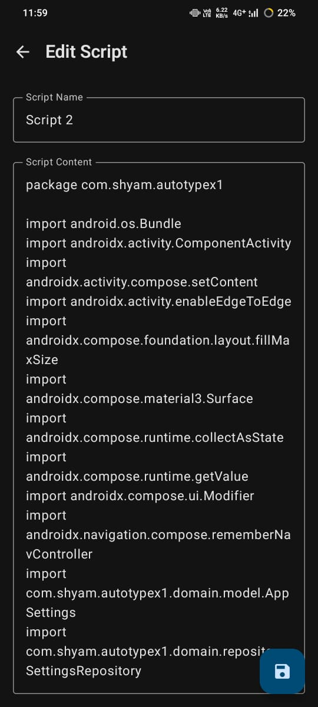
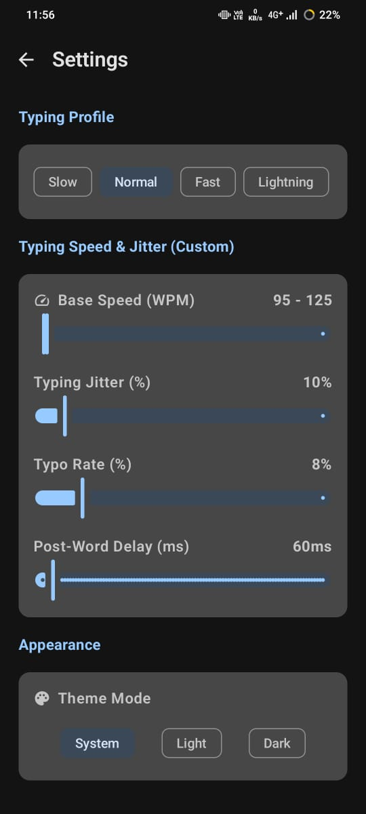

# AutoType X1

**AutoType X1** is an open-source Android application that emulates a physical Bluetooth HID keyboard. It connects to nearby computers (Windows, Linux, macOS) or Android devices and transmits user-configured text scripts as hardware keystrokes with human-like typing timing and error simulation.

---

## Screenshots

<p align="center">
  
  &nbsp;&nbsp;
  
  &nbsp;&nbsp;
  
</p>

<p align="center">
  
  &nbsp;&nbsp;
  
  &nbsp;&nbsp;
  
</p>

---

## Features

- **Bluetooth HID Keyboard Emulation:** Connects as a standard Bluetooth HID keyboard device over Bluetooth Classic — no root required on the phone, no software installation required on the host.
- **Human-Like Typing Engine:** Realistic keystroke timing, WPM control, micro-jitters, QWERTY-adjacent typos, and backspace self-correction.
- **Typing Profiles:** Built-in profiles including *Natural*, *Casual*, *Professional*, and *Speed Demon*.
- **Script Management:** Save, edit, organize, and execute reusable text scripts.
- **Background Execution:** Runs via an Android Foreground Service with status notifications, allowing typing even when the screen is locked or the app is backgrounded.
- **Privacy-First & Offline:** **Zero internet permissions.** No telemetry, no tracking, no third-party SDKs, no cloud sync. All scripts and device data remain on device.
- **Modern UI:** Built using Jetpack Compose with Material 3 design and dark mode support.

---

## Download & Installation

### Option 1: Download Release APK

Download the latest compiled release package directly from GitHub Releases:

📦 **[Download Latest Release APK (v1.0.0)](https://github.com/Shyam-Dev18/auto-type-x1/releases)**

1. Download `AutoTypeX1-v1.0.0.apk` to your Android device.
2. Open the file and allow installation from unknown sources if prompted.
3. Launch **AutoType X1** and grant the required Bluetooth permissions.

### Option 2: Build From Source

1. Enable **Developer Options** and **USB Debugging** on your Android device.
2. Connect your device via USB.
3. Build and install via Gradle:
   ```bash
   ./gradlew installDebug
   ```

---

## How It Works

```text
┌─────────────────────────┐           Bluetooth Classic HID            ┌─────────────────────────┐
│     AutoType X1         │ ─────────────────────────────────────────> │        Host OS          │
│   (Android Device)      │      Keystrokes (USB HID Usage Codes)      │ (Windows/Linux/macOS)   │
└─────────────────────────┘                                            └─────────────────────────┘
```

1. Pair your Android device with the target computer over Bluetooth.
2. Open AutoType X1 and select your paired computer from **Add Device**.
3. Create or select a script in **Scripts**.
4. Choose a typing profile in **Settings** or on the **Typing** screen.
5. Tap **Start Typing**. The application sends raw HID key reports over Bluetooth to the target computer.

---

## Requirements

- **Android Device:** Android 9 (API 28) or higher with Bluetooth Classic support.
- **Target Host:** Any device that supports Bluetooth HID keyboards (manually verified on Windows 10/11 and Android; expected compatible on Linux and macOS).
- **Physical Hardware:** Testing must be performed on physical Android hardware. Android emulators do not support Bluetooth HID.

---

## Bluetooth HID Compatibility

AutoType X1 relies on Android's `BluetoothHidDevice` API introduced in Android 9 (API 28).

- Most modern Android smartphones natively support the Bluetooth HID Device profile.
- Some manufacturer-customized ROMs or budget chipset firmware may disable HID profile registration at the kernel/HAL level.
- Host support is universal: standard OS Bluetooth stack drivers recognize AutoType X1 as a physical keyboard.

---

## Permissions

| Permission | Purpose |
|---|---|
| `BLUETOOTH` / `BLUETOOTH_ADMIN` | Required for Bluetooth Classic state on Android 11 and below |
| `BLUETOOTH_CONNECT` | Required to connect to paired HID hosts (Android 12+) |
| `BLUETOOTH_SCAN` | Required to discover nearby Bluetooth devices (Android 12+) |
| `ACCESS_FINE_LOCATION` / `ACCESS_COARSE_LOCATION` | Required for Bluetooth Classic scanning on Android 11 and below |
| `FOREGROUND_SERVICE` | Keeps the typing service active when app is backgrounded |
| `POST_NOTIFICATIONS` | Displays the active status notification (Android 13+) |

---

## Privacy

AutoType X1 holds **no internet permissions** (`android.permission.INTERNET` is absent). Your scripts, paired device lists, and settings never leave your phone.

Read our complete [Privacy Policy](PRIVACY.md).

---

## Building From Source

### Prerequisites
- JDK 17
- Android SDK (API 36 compileSdk)

### Build Commands

```bash
# Clone the repository
git clone https://github.com/Shyam-Dev18/auto-type-x1.git
cd auto-type-x1

# Run unit tests
./gradlew test

# Run Android Lint
./gradlew lint

# Build Debug APK
./gradlew assembleDebug
```

---

## Architecture

AutoType X1 is built following **Clean Architecture** principles:

- `presentation/`: Jetpack Compose, ViewModels, Navigation graph
- `domain/`: Business logic, typing engine, models, repository interfaces
- `data/`: Room database, DataStore, Bluetooth HID implementation (`BluetoothHidRepositoryImpl`)
- `core/`: Hilt DI modules, Foreground Service, permission utilities

For full details, read [docs/ARCHITECTURE.md](docs/ARCHITECTURE.md).

---

## Known Limitations

- **Keyboard Layout:** Currently mapped for US QWERTY keyboard layout. Target hosts configured with alternative layouts (e.g. AZERTY, QWERTZ) may register different symbols.
- **Unicode Support:** Non-Latin character sets (e.g. Cyrillic, CJK) and emojis cannot be directly mapped to standard US HID key codes and are omitted.

---

## Contributing

Contributions are welcome! Please read [CONTRIBUTING.md](CONTRIBUTING.md) and [CODE_OF_CONDUCT.md](CODE_OF_CONDUCT.md) before submitting pull requests.

---

## Security

To report security concerns confidentially, please refer to our [Security Policy](SECURITY.md).

---

## License

This project is licensed under the [MIT License](LICENSE).
